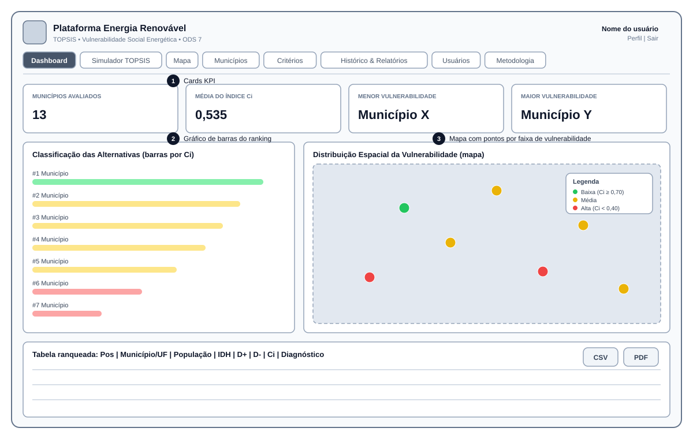
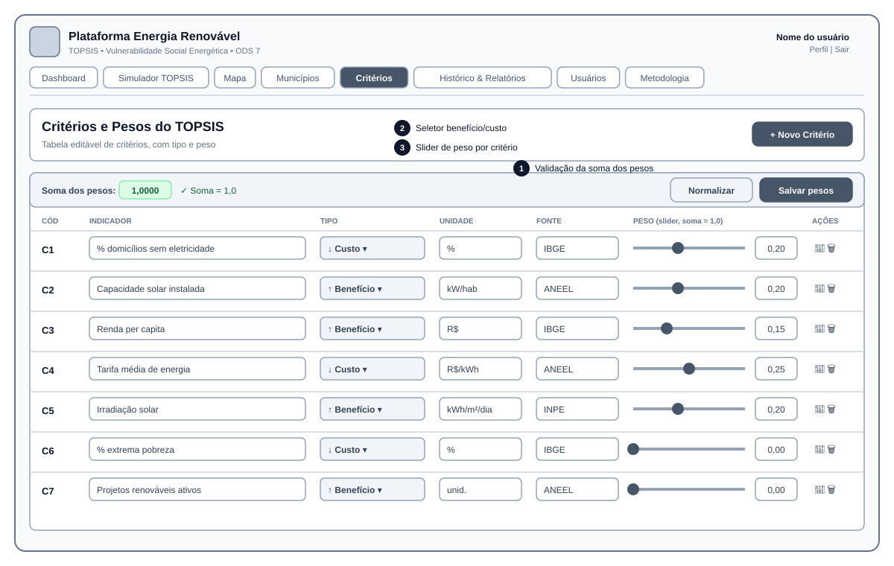
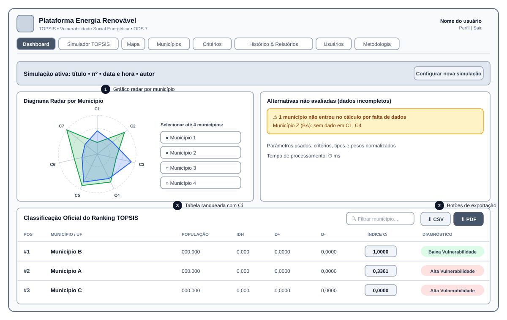
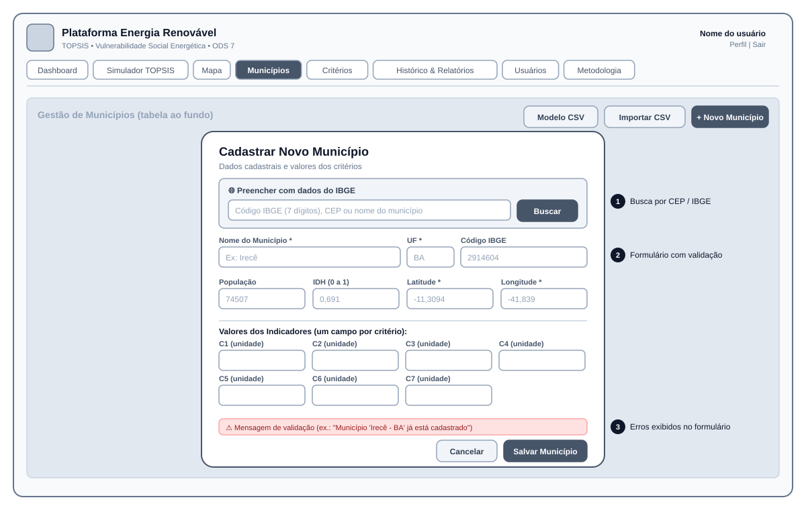
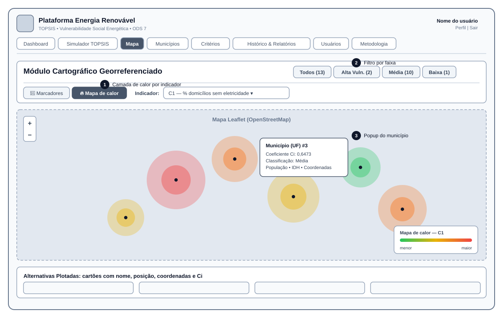

# Protótipos de Telas
## Plataforma de Energia Renovável com TOPSIS
**Conforme Capítulo 8 do Roteiro Metodológico**

Protótipos de baixa fidelidade (wireframes) das cinco telas principais indicadas no roteiro. Os arquivos são SVG:
abrem direto no navegador e podem ser importados no Figma ou no Excalidraw para edição. Os números em círculo
destacam os elementos pedidos pelo roteiro em cada tela.

| # | Tela (roteiro) | Elementos exigidos | Protótipo | Tela implementada |
|:---:|---|---|---|---|
| 1 | Dashboard Principal | Cards KPI, gráfico de barras do ranking, mapa com pontos coloridos por faixa de vulnerabilidade | [01_dashboard_principal.svg](01_dashboard_principal.svg) | aba **Dashboard** (`DashboardPage.jsx`) |
| 2 | Configuração TOPSIS | Tabela editável de critérios com sliders de peso (soma = 1,0) e seletor de tipo (benefício/custo) | [02_configuracao_topsis.svg](02_configuracao_topsis.svg) | aba **Critérios** (`CriteriosPage.jsx`) e **Simulador TOPSIS** |
| 3 | Resultado da Simulação | Tabela ranqueada com Cᵢ, gráfico radar por município, botão de exportação | [03_resultado_simulacao.svg](03_resultado_simulacao.svg) | aba **Dashboard** (`RadarChart.jsx`, `ResultsTable.jsx`) |
| 4 | Cadastro de Municípios | Formulário com validação, busca por CEP/IBGE | [04_cadastro_municipios.svg](04_cadastro_municipios.svg) | aba **Municípios** (`MunicipiosPage.jsx`) |
| 5 | Mapa Georreferenciado | Leaflet com camadas de calor por indicador | [05_mapa_georreferenciado.svg](05_mapa_georreferenciado.svg) | aba **Mapa** (`MapaPage.jsx`, `MapaLeaflet.jsx`) |

### 1. Dashboard Principal

### 2. Configuração TOPSIS

### 3. Resultado da Simulação

### 4. Cadastro de Municípios

### 5. Mapa Georreferenciado

