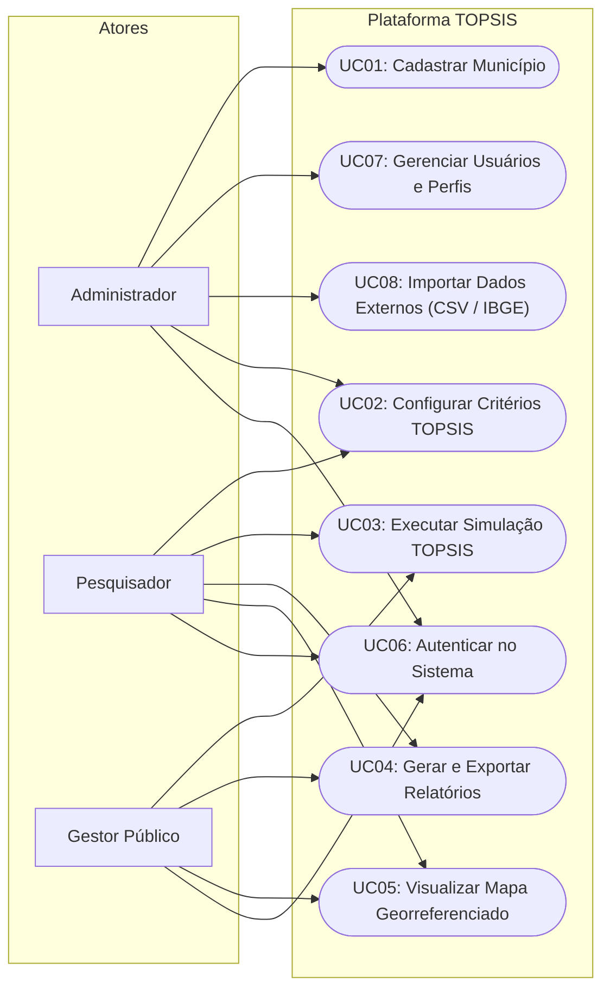
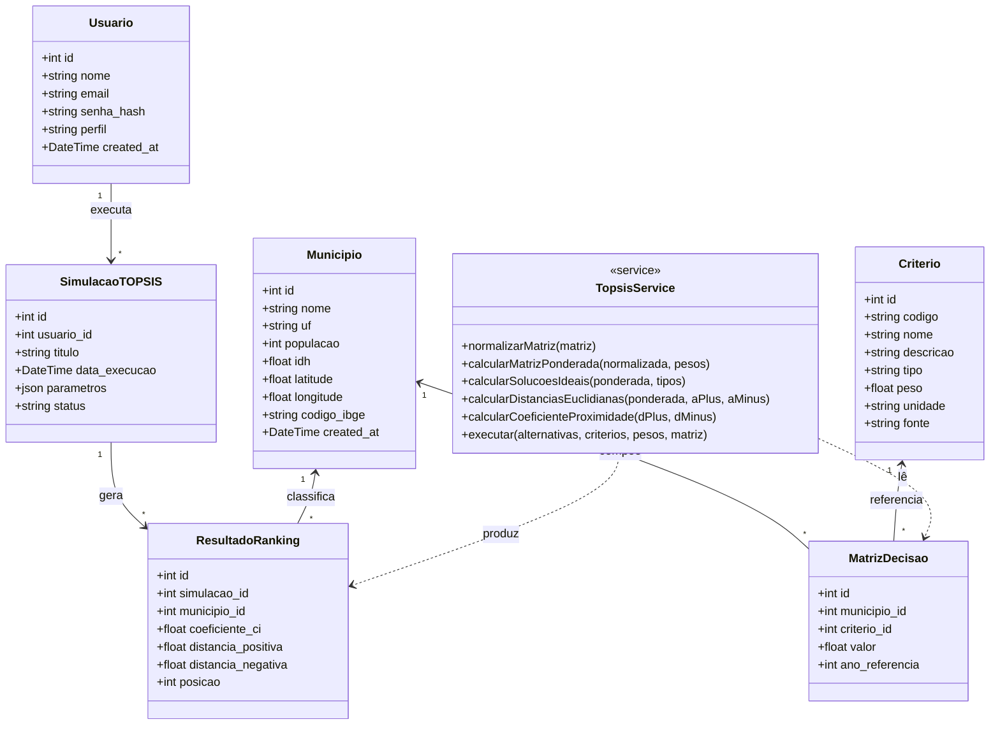
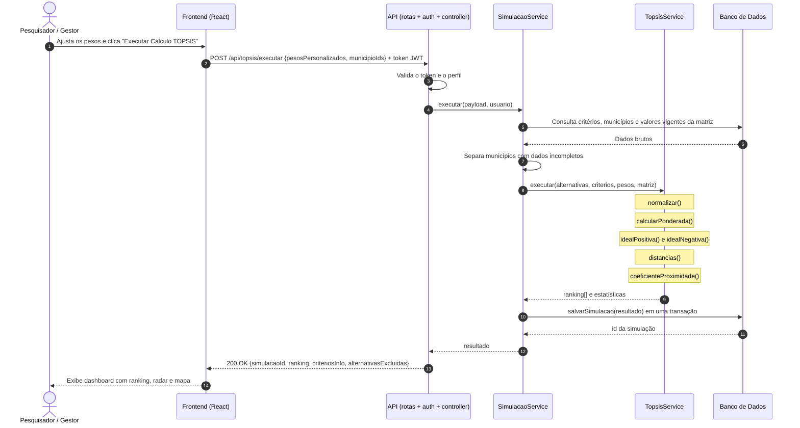
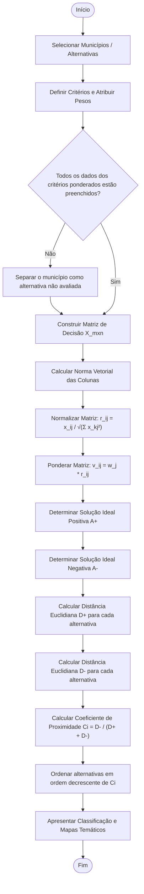
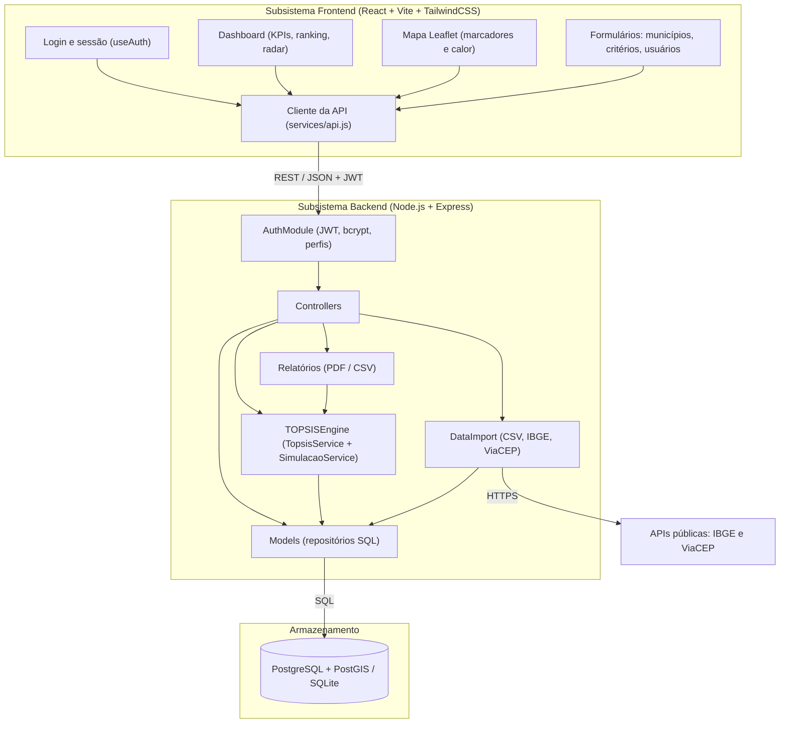
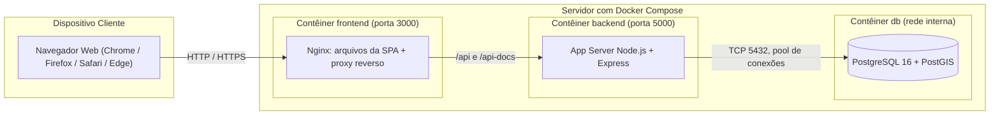

# Modelagem UML Completa do Sistema
## Plataforma de Energia Renovável com TOPSIS
**Conforme Capítulo 4 do Roteiro Metodológico**

---

## 4.1 Diagrama de Casos de Uso

O Administrador também pode executar UC03, UC04 e UC05 (omitidos no diagrama para não poluí-lo). Todos os casos de uso têm como pré-condição o UC06.

### Especificação Textual dos Principais Casos de Uso

#### UC01 — Cadastrar Município
- **Ator Primário:** Administrador
- **Pré-condição:** Administrador autenticado no sistema com perfil válido.
- **Fluxo Principal:**
  1. O Administrador acessa a aba "Municípios" e seleciona "Novo Município".
  2. O sistema exibe o formulário com Nome, UF, Código IBGE, População, IDH, Latitude, Longitude e um campo por critério.
  3. O Administrador preenche os dados (ou usa "Preencher com dados do IBGE") e clica em "Salvar Município".
  4. O sistema valida os campos e verifica a unicidade do par (Nome, UF) e do código IBGE.
  5. O sistema persiste o município e seus indicadores em uma única transação e atualiza a listagem.
  6. O sistema exibe mensagem de confirmação.
- **Fluxos Alternativos:** dados inválidos ou município já cadastrado — o sistema informa o motivo e mantém o formulário aberto. Os mesmos passos valem para editar e excluir.

#### UC02 — Configurar Critérios TOPSIS
- **Ator Primário:** Pesquisador
- **Fluxo Principal:**
  1. O Pesquisador acessa a aba "Critérios".
  2. O sistema apresenta os indicadores cadastrados com tipo, unidade, fonte e peso.
  3. O Pesquisador cria, edita ou exclui critérios, altera o tipo (Benefício ou Custo) e ajusta os sliders de peso.
  4. O sistema só permite salvar os pesos quando a soma é $1,0$ ($100\%$).
  5. O sistema grava a configuração, que passa a ser o padrão das próximas simulações.

#### UC03 — Executar TOPSIS
- **Atores:** Pesquisador, Gestor Público
- **Fluxo Principal:**
  1. O ator seleciona os municípios a serem incluídos na análise comparativa.
  2. O ator revisa os pesos (ou escolhe um cenário) e aciona "Executar Cálculo TOPSIS".
  3. O sistema monta a matriz de decisão com os valores vigentes e a envia ao motor matemático.
  4. O motor executa a normalização vetorial, calcula $A^+$, $A^-$, as distâncias euclidianas e o coeficiente $C_i$.
  5. O sistema armazena a simulação no histórico e exibe os gráficos de ranking, a tabela detalhada e o mapa.
- **Fluxo Alternativo:** municípios sem dado em algum critério ponderado ficam fora do cálculo e são listados em um aviso; com menos de 2 alternativas completas o cálculo não é executado.

#### UC04 — Gerar Relatório
- **Ator Primário:** Gestor Público
- **Fluxo Principal:**
  1. O Gestor visualiza os resultados de uma simulação TOPSIS.
  2. O Gestor seleciona o formato de exportação desejado (PDF analítico ou planilha CSV).
  3. O sistema compila a síntese metodológica, dados brutos, pesos aplicados e ranking final.
  4. O arquivo gerado é transferido para o dispositivo do usuário.

---

## 4.2 Diagrama de Classes de Domínio

---

## 4.3 Diagrama de Sequência — Execução do TOPSIS

---

## 4.4 Diagrama de Atividades — Algoritmo TOPSIS

---

## 4.5 Diagrama de Componentes

---

## 4.6 Diagrama de Implantação

Em desenvolvimento, sem Docker, o backend usa um arquivo SQLite local e o Vite faz o papel de proxy.
