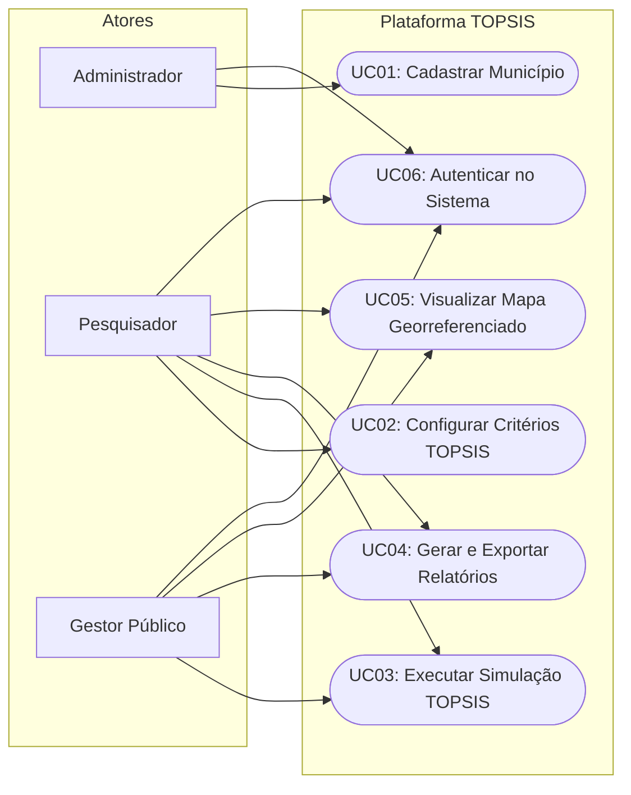
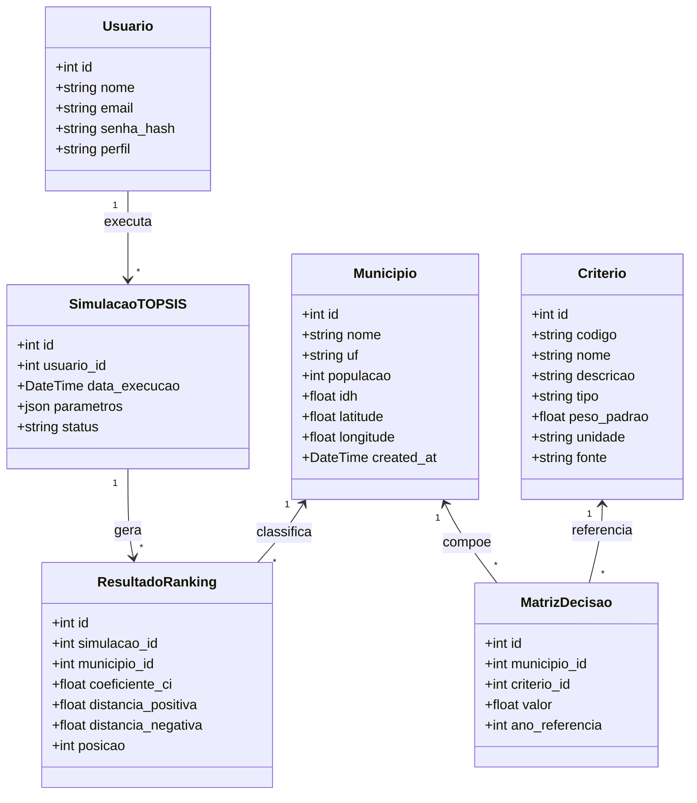
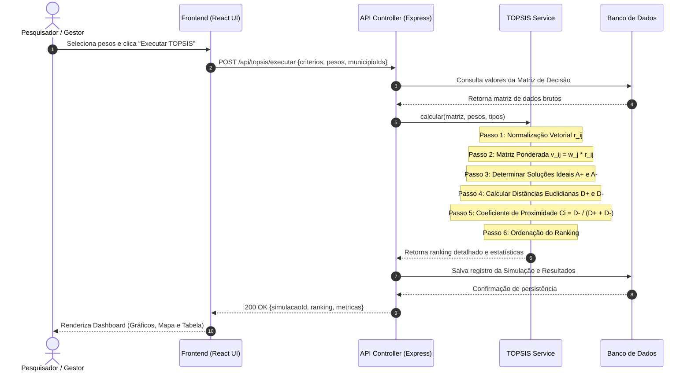
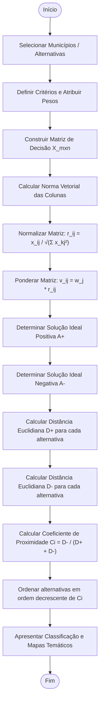
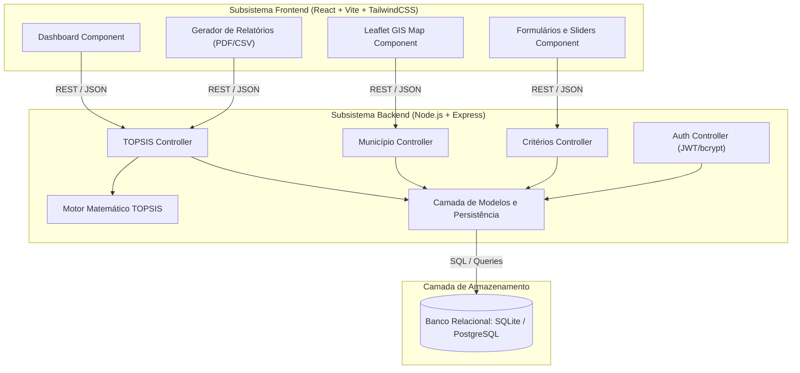
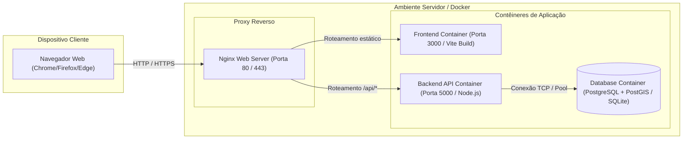

# Modelagem UML Completa do Sistema
## Plataforma de Energia Renovável com TOPSIS
**Conforme Capítulo 4 do Roteiro Metodológico**

---

## 4.1 Diagrama de Casos de Uso

### Especificação Textual dos Principais Casos de Uso

#### UC01 — Cadastrar Município
- **Ator Primário:** Administrador
- **Pré-condição:** Administrador autenticado no sistema com perfil válido.
- **Fluxo Principal:**
  1. O Administrador acessa a aba "Municípios" e seleciona "Cadastrar Novo Município".
  2. O sistema exibe o formulário solicitando Nome, UF, População, IDH, Latitude e Longitude.
  3. O Administrador preenche os dados e clica em "Salvar".
  4. O sistema valida os campos obrigatórios e verifica a unicidade do par (Nome, UF).
  5. O sistema persiste as informações no banco de dados e atualiza a listagem.
  6. O sistema exibe mensagem de confirmação de cadastro bem-sucedido.

#### UC02 — Configurar Critérios TOPSIS
- **Ator Primário:** Pesquisador
- **Fluxo Principal:**
  1. O Pesquisador acessa a tela de "Configuração de Critérios".
  2. O sistema apresenta a lista de indicadores cadastrados (C1 a C7) com pesos atuais e tipos.
  3. O Pesquisador ajusta os sliders de ponderação ou altera o direcionamento (Benefício ou Custo).
  4. O sistema valida automaticamente se a somatória dos pesos atinge $1,0$ ($100\%$).
  5. O sistema salva a configuração para uso na simulação corrente.

#### UC03 — Executar TOPSIS
- **Atores:** Pesquisador, Gestor Público
- **Fluxo Principal:**
  1. O ator seleciona os municípios a serem incluídos na análise comparativa.
  2. O ator revisa os critérios selecionados e aciona "Calcular TOPSIS".
  3. O sistema despacha a matriz de decisão ao motor matemático.
  4. O motor executa a normalização vetorial, calcula $A^+$, $A^-$, as distâncias euclidianas e o coeficiente $C_i$.
  5. O sistema armazena a simulação no histórico e renderiza os gráficos de ranking, tabela detalhada e mapa temático.

#### UC04 — Gerar Relatório
- **Ator Primário:** Gestor Público
- **Fluxo Principal:**
  1. O Gestor visualiza os resultados de uma simulação TOPSIS.
  2. O Gestor seleciona o formato de exportação desejado (PDF analítico ou planilha CSV).
  3. O sistema compila a síntese metodológica, dados brutos, pesos aplicados e ranking final.
  4. O arquivo gerado é transferido para o dispositivo do usuário.

---

## 4.2 Diagrama de Classes de Domínio

---

## 4.3 Diagrama de Sequência — Execução do TOPSIS

---

## 4.4 Diagrama de Atividades — Algoritmo TOPSIS

---

## 4.5 Diagrama de Componentes

---

## 4.6 Diagrama de Implantação

